# Leveraging Deep Learning to Facilitate Fish Counts

#### Jamie Shaffer, July 2020

### Contents
- [Executive Summary](#Executive-Summary)
- [Introduction](#Introduction)
- [Data Collection](#Data-Collection)
- [Deep Learning Models](#Deep-Learning-Models)
- [Conclusions](#Conclusions)
- [References](#References)

## Executive Summary

In the Pacific Northwest, salmon are vital to commerce and to the marine ecosystem, and fish population estimates are key factors in many policy decisions. Current methods require trained biologists to observe the fish passing a viewing window and manually record the fish count on a daily basis.

This project explored the possibility of using machine learning methods of object detection and classification to support these efforts, potentially enabling the collection of data in more locations and over longer time periods.

Custom trained models (e.g. YOLO v5) using images from fish ladders showed that accurate fish detection is promising but non-trivial, counting fish in a still image does not solve the problem of counting fish in video, and that classifying fish by species requires excellent viewing conditions.

## Introduction

Salmon life cycles follow a predictable pattern: hatch in fresh water, migrate to the ocean for the majority of their lives, and then migrate back to their original fresh water hatch sites before they spawn and then die. The time spent in fresh water and ocean salt water depends on the species.

Salmon populations in the waters of Puget Sound are estimated each year when a mature portion of the salmon migrate back from the ocean to fresh water to spawn. In many areas, this pathway is partially obstructed by boat locks (Seattle), or hydroelectric dams (Bonneville) and the salmon travel through carefully built fish ladders on this upstream journey. As they pass through the ladders, viewing windows allow them to be seen by both tourists and biologists, and human viewers are still the primary way to count the fish.

|Fish ladder| Bonneville Dam public window| Bonneville counting window (non-public)|
|---|---|---|
|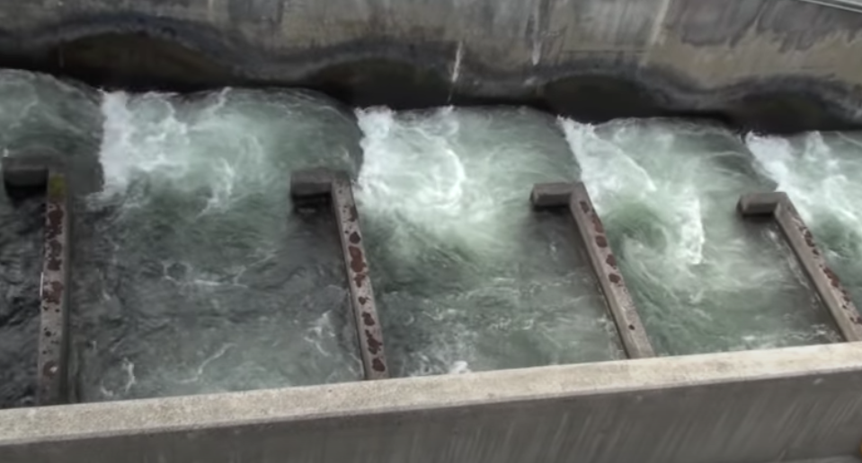| 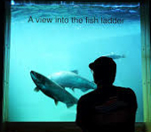||
|Watch at https: //www youtube com/watch?v=sabk7Khq0kQ||Photo: (c) Phillip Colla OceanLight.com|

Once tallied, the estimated population for each species determines sport fishing limits such as the number of fish per day and the length of the fishing season. This data is also used to make decisions in the operation of salmon fisheries, commercial fishing, restaurants, and tourism.

|Columbia River Chinook Season|Ballard Locks 2020 Sockeye Counts|
|---|---|
|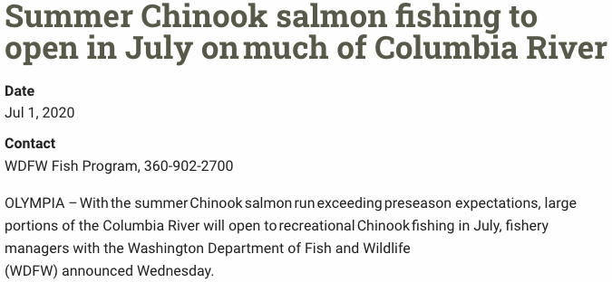|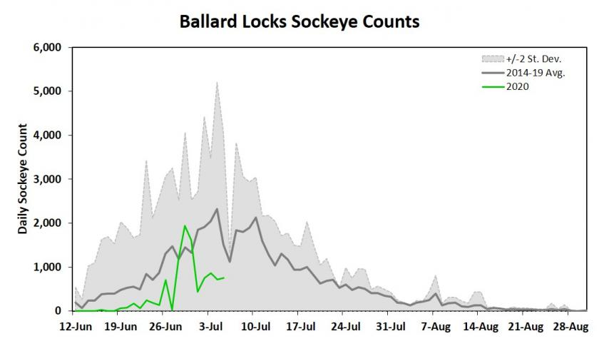|
|News source: https://wdfw.wa.gov/news/summer-chinook-salmon-fishing-open-july-much-columbia-river | Updated count: https://wdfw.wa.gov/sites/default/files/styles/page_body_full_width/public/2020-07/ballard_locks_sockeye_counts_7520.jpg?itok=Q8rJ2m5S"|

The salmon counting task is trivial when few are in the ladder; the task is far more difficult when many are returning at once. As a result, some locations estimate the full population by counting for a set period of time each day and comparing  to historical data. In other locations, 24/7 video recording enables biologists to review footage and tally the counts later; weekend tallies can take staff multiple days to catch up on counts. Interested individuals can sign up for daily notifications on the latest counts.

## Data Collection

Over the course of 2 weeks in June 2020, an internet search found 168 usable images of fish traveling past viewing windows. Of these, the majority were taken by tourists and often feature the silhouettes of children in front of the glass. Images of official viewing windows were very difficult to find, in part because 1) they are probably not particularly interesting to most people and 2) for security reasons, the fish cam at the Bonneville Dam (Willamette Falls) has been disabled.

With the use of image augmentation, the original collection of 168 images was expanded by including horizontal flip, random adjustments to exposure (+/- 25%), and random changes to rotation (+/- 15%). The final 504 images contained 725 annotated fish (averaging 4.3 per image), and included 2 null examples of viewing windows with no fish.

|Image variation 1 | Image variation 2 | Labeled Image|Null Training Image|
|---|---|---|---|
|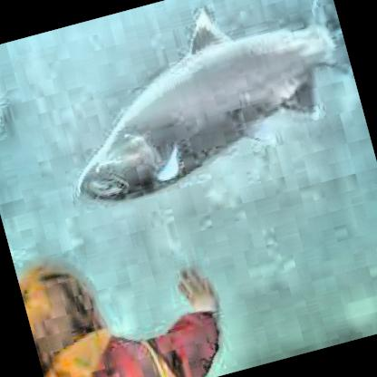|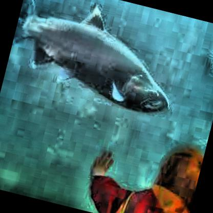|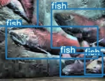||

For image classification, images need to contain a limited number of objects (preferably just one) and a machine learning algorithm will attempt to name the object in the image. All that is needed is an image and a single label, e.g. "cat" or "dog".

Object detection refers to the case where there are multiple instances of an object or when there are a variety of other objects also in the image. In this situation, the image also needs to be labelled to show where each object is located. Most algorithms use a bounding box for this.

The original 168 fish images were manually labeled using the free tool "labelImg" (see https://pypi.org/project/labelImg/) to draw the bounding boxes. Free tools from roboflow.ai (see https://roboflow.ai/) were used to perform the image augmentation. Leveraging the roboflow tools provided several additional benefits: the bounding boxes were automatically adjusted for images that were randomly rotated, and the images and annotations could be quickly exported in multiple formats for use in a variety of models.

## Deep Learning Models

**YOLO v5**

"You Only Look Once". YOLO is a popular object detection machine learning model introduced in 2015 by a group of researchers at the University of Washington. Rather than pass an image classifier multiple times over an image to see if there was, say, a dog at the upper left, or maybe at the upper right, this new approach replaced the final layers of an image classifier with additional convolutional layers that allowed it to find all instances in one pass. The immediate improvement in speed was a major leap forward for computer vision and object detection. Since the original paper, the model has been improved several times with Version 5 being released in June 2020.

Given the popularity, speed, and accuracy of YOLO, the YOLO v5 model flow available through roboflow.ai was an obvious choice. Earlier YOLO versions have keras and tensorflow implementations and can be run on a variety of hardware. At this time, only a PyTorch version of YOLO v5 has been built. This version leverages the computational speed and efficiency of a GPU for excellent results, and there are a number of examples available in blog posts and in github. For this project, the Google Colaboratory template from roboflow.ai was used. This template configures the environment and builds the model, so a simple customization consists of uploading a new training set and selecting the number of epochs for training. Once trained, the confidence threshold can be adjusted before making predictions.  

For this first model, it became apparent that labeling the fish by species was going to be highly problematic. First, identification is a challenge. Sport fishermen are discouraged from identifying fish by side view alone as this can be misleading; they are instead instructed to observe inside the mouth and to look at the color of the gum line. In cloudy, poorly lit conditions, other features such as silver highlights on the tail or where the black spots are located are very difficult to see. Second, training a model to recognize fish by species requires properly labeled images, and there were no fish experts working on this project. In lieu of counting by species, the project was scaled back to count them all as 'fish'. As a first pass, even this highlighted plenty of issues.

|Sockeye| Chinook | Coho | What's this?|
|---|---|---|---|
|||||

Scaling back to just finding a generically labeled "fish", and scaling up to cloud based GPU resources with the latest YOLO v5 model, the results were mixed and not ready to replace a fisheries biologist.

|Impressive|Humorous|How many fish are really in here?|
|---|---|---|
|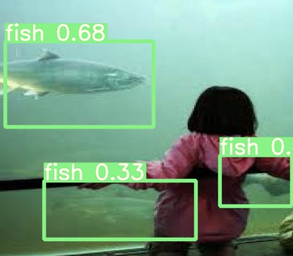|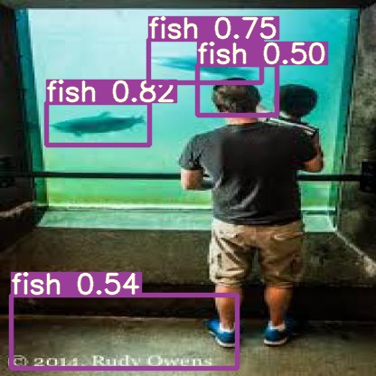|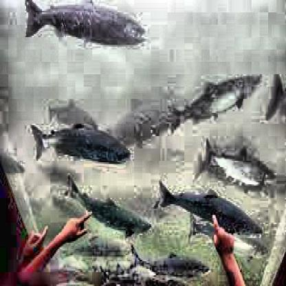|
||Photo: (c) 2014 Rudy Owens||
|Note 1               |Note 2|Note 3|

Notes:
 1. Impressive find: Even so, an unobstructed view is an easy improvement, and this is the case for the non-public viewing windows.
 2. Humorous finds: This phantom floor fish is reminiscent of the light-dark patterns of the Viola-Jones algorithm, possibly providing a clue to what may be happening. A change in lighting may result in model improvements. Note the careful arrangement of can lights in the Bonneville viewing window shown previously.
 3. Challenges: Height and width of window are not issues, but the depth of the tank is a problem.

In terms of model metrics, the graphs below show the results of 100 training epochs (blue) and progress on 1000 training epochs (orange). In the 1000 epoch case, the model stopped making significant improvements before all training epochs were completed.
*Note: as of July 2020, YOLO v5 does not have the ability to save the best model.*

**Model Metrics**

|Precision|Recall|mAP 0.5|
|---|---|---|
|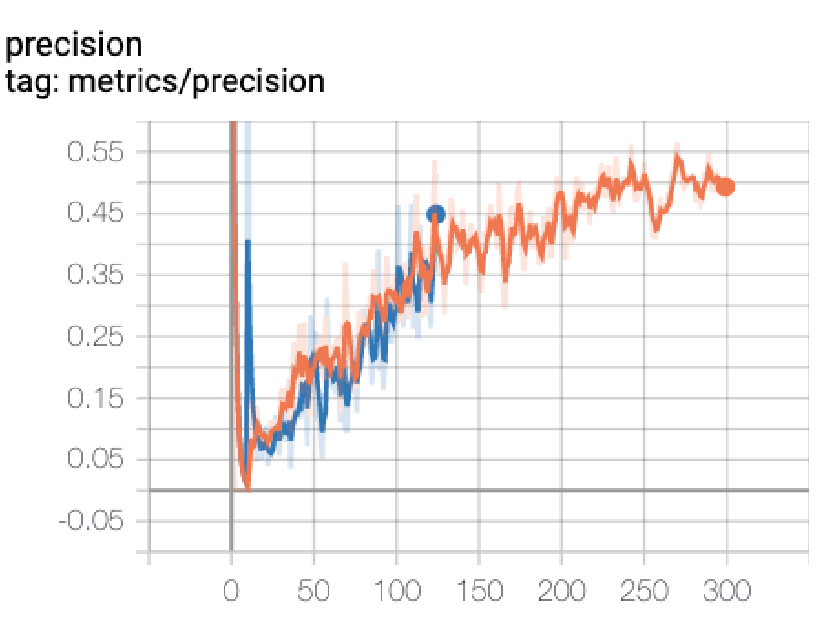|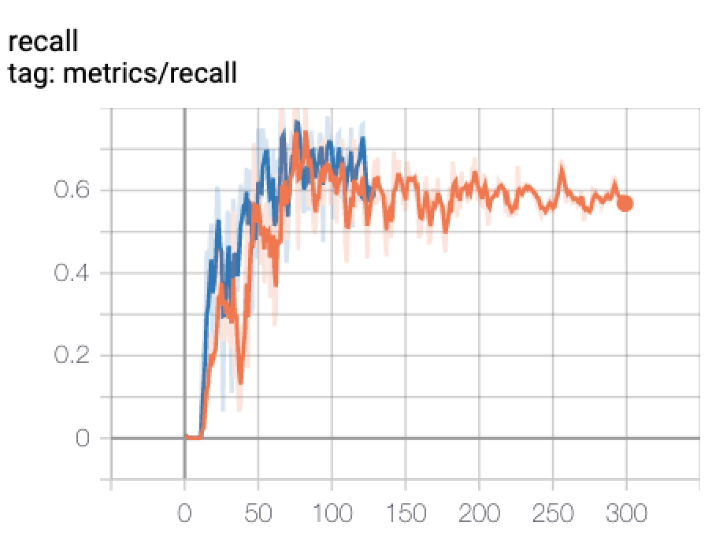|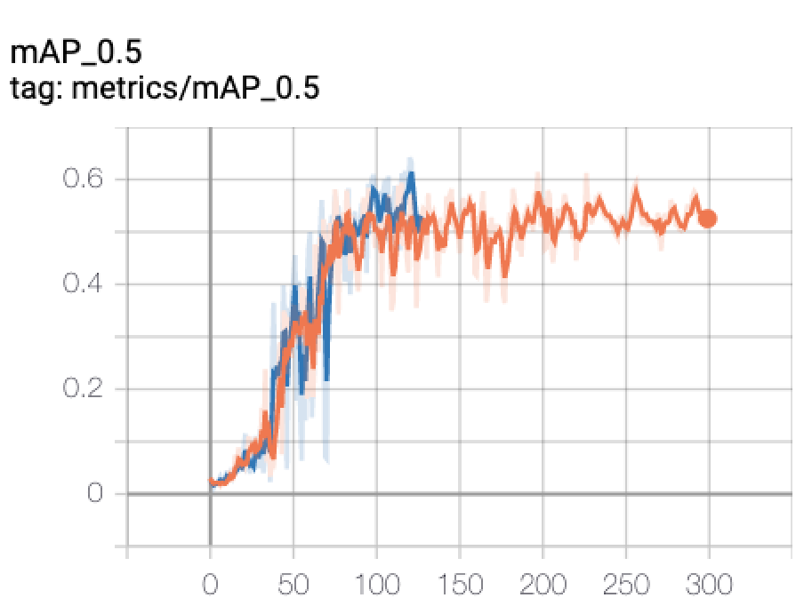|
|Precision is the accuracy of the positive predictions (TP / TP+FP) or "If you say it's a fish, what percentage of the time is it really a fish?"|Recall is the true positive rate (TP / TP+FN) or "If there's a fish in there, what percentage of the time do you find it?"| mAP_0.5 See longer text description. |

For object detection, precision and recall are similar to their definitions in other types of machine learning. However, there is an additional consideration here, best illustrated with an example. Let's say the image has a single fish, and the model finds a single fish but draws the box on the floor. Would we want to call that a success? Or, what if it draws the box around only the head of the fish but not the body? Do we want to give it partial credit? The solution to this dilemma is something like partial credit, where the amount of overlap between the box drawn and the expected box determines the mAP (mean average precision). The most common metric here is "50% overlap", or mAP@.5. So, if we count the boxes where the model's box overlaps the label box by at least 50%, this model is providing correct answers in roughly 50% of the cases.

## Conclusions

Based on the results from YOLO v5, salmon counting by object detection is definitely possible, and there also remain several challenges to be solved. These challenges include:

 - Viewing windows with excellent lighting are required
 - Viewing window height and width are not critical, but the depth needs to be carefully selected to reduce the number of fish that can obscure other fish
 - Correct species labels are required for training a model to separate sockeye, chinook, and coho in addition to other species

From personal experience (easily confirmed by watching online videos), salmon swimming upstream in a fish ladder pause to rest for varying amounts of time. In some cases, they will swim slowly and maintain position, and at other times they will slow to the point that they drift backward with the current. This adds an additional level of complexity that will require an advanced system to track objects (fish) from one video frame to the next.

Video counts will require
 - Ability to track an individual fish regardless of forward or backward movement
 - Only a single count irrespective of the amount of time a fish remains in the viewing window

## References

### Salmon, salmon counting, and salmon fishing policies
 - https://www.nps.gov/olym/learn/nature/the-salmon-life-cycle.htm
 - https://youtu.be/zoHpE5scs2I
 - http://www.fpc.org/currentdaily/HistFishTwo_7day-ytd_Adults.htm
 - https://wdfw.wa.gov/news/washingtons-salmon-seasons-tentatively-set-2020-21
 - http://pweb.crohms.org/tmt/documents/fpp/2020/final/FPP20_02_BON.pdf
 - https://idfg.idaho.gov/fish/chinook/dam-counts
 - http://www.cbr.washington.edu/dart/query/adult_daily
 - http://www.eregulations.com/washington/fishing/salmon-identification/

### Machine learning

 - https://pypi.org/project/labelImg/
 - https://roboflow.ai/
 - https://arxiv.org/abs/1506.02640
 - https://towardsdatascience.com/how-to-train-a-custom-object-detection-model-with-yolo-v5-917e9ce13208
 - https://en.wikipedia.org/wiki/Viola%E2%80%93Jones_object_detection_framework
 - Hands-On Machine Learning with
Scikit-Learn and TensorFlow by Aurélien Géron (O’Reilly). Second edition. Copyright 2019.

[Return to Table of Contents](#Contents)
